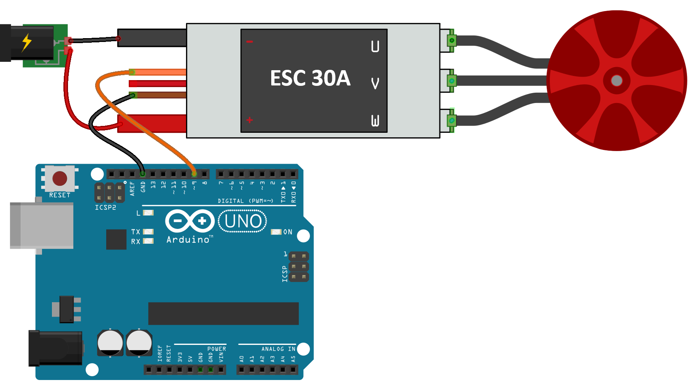

# ESC_Brushless_Control

## Arduino Control for ESC Brushless RC Motor ##

*O firmware habilita o arduino para controlar 4 ESCs via comando serial sem a necessidade de ter um potenciometro para simular a aceleração.*

__Procedimento de Uso__

* Abra o Código no seu Arduino IDE(recomendado por ter uma interface serial mais funcional que o plataformio)
* Compile e Carregue o código no seu Arduino;
* Conecte o fio de sinal do ESC1, ESC2, ESC3 e ESC 4 aos pinos 9,10,11 e 12 do arduino respectivamente, e conecte o fio de ground(terra ao GND do arduino);
___OBS.: (você pode usar somente um ESC em qualquer uma das portas do arduino conforme sua preferência).___
* Abra o Monitor Serial;
* Conecte os fios de alimentação do seu ESC a uma bateria ou fonte externa de sua preferência;
* Clique no botão reset do seu arduino e vc verá os beeps característicos dos seus ESCs sendo armados na inicialização do código do arduino;
* Digite o comando "esc1 0" por exemplo, isso enviará o comando para o ESC1 com uma carga de 0% de rotação e assim por diante;
___OBS.: (dependendo do ESC e do motor acoplado a este, a rotação só começará com 32% de carga no ESC escolhido)___
     
___💥💥💥Recomendo que NÃO use as hélices nos motores para realização dos testes e, mesmo assim tome cuidado fixe os motores a uma base pesada o suficiente para que a força de torque do mesmo seja anulada facilmente pela fixação da base, suba os valores de carga do comando na serial gradativamente até pegar o jeito e ter uma noção da força exercida nos motores ao trocar os valores pela serial)___

__Exemplos de comandos na serial:__

`esc1 0`
`esc1 32`
`esc1 40`
`esc2 40`
`esc3 40`
`esc4 40`

__Exemplo do Esquemático de conexão dos fios para um ESC conectado ao pino 9 do arduino:__

:exclamation: Feito por diversão e disponibilizado para a comunidade. 😎